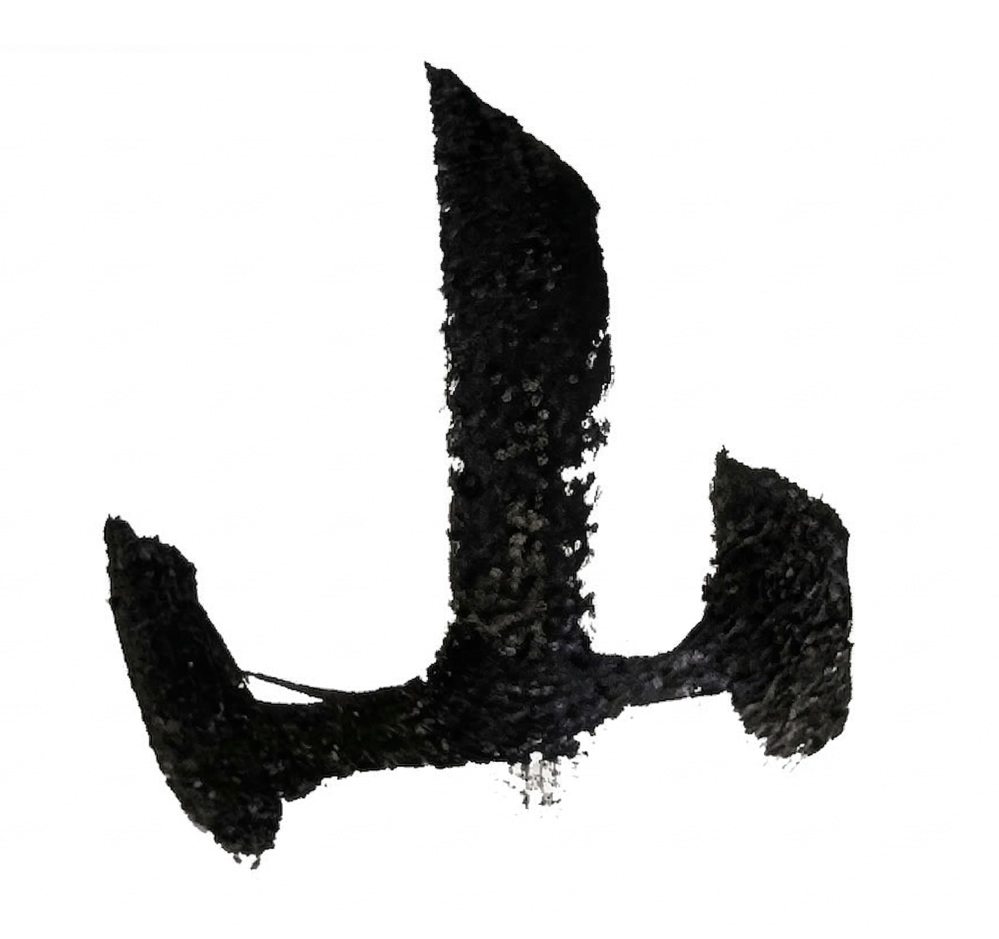

# Chapter 1: 山 {-}

*泉、泥、石*

> 山在那里。(Because it's there.)
- George Mallory

**tp_image**

{width=100%}

## 泉水

我出生在山里。

村子不大，十几户人家。

大多姓贺。

山在四周。

天一亮就是山，

天黑了也是山。

我不知道山那边是什么，

也没想过要问。

世界就是眼前这些：

屋后的坡、门前的沟、再远一点的田，

和永远在的泉水。

\
泉水从山缝里出来，

据说几百年没断过。

土话里，

那个泉水叫羊咪咪，

就是蜻蜓泉的意思。

人们用竹管把水接到家里，

我们家也有。

水接到灶边，接到缸里，

渴了趴下去喝一口，

凉，

带一点石头和青苔的味道。

我到现在都记得那味道。

\

泉水上面有颗枣树，

泉水往下流，

变成一条小溪。

我蹲在溪边，

把石头翻过来。

石头底下有时候会躲着螃蟹。

我一伸手，就把它抓住。

都是些小螃蟹，大的我不敢抓。

抓上来，

放在手心，

它横着爬。

我不吃它，玩一会儿就放回去。

溪水清得见底。

几百年了，

水没断，

螃蟹也没断。

\
溪水流下去的地方，

有一块大石头。

不是普通的石头，

是石灰岩。

白里带青，一层一层的。

像一排书页立在那里。

老人说，这块石头不是从山上掉下来的。

是水一点一点滴出来的。

滴了很多很多年。

我常去那儿坐，

脚泡在水里，

背靠着石头。

太阳晒在石头上，石头是暖的；

水从脚背上过去，

是凉的。

那时候我还不知道该怎么说。

只是觉得在那儿待着，很安心。

## 泥土

我很小的时候，就喜欢玩泥。

不是所有的泥都好玩。

有些太干，一捏就裂开。

有些太沙，怎么压也粘不住。

但山坡下面有一块地方的土不一样。

那里的泥很细，很软，

用手一揉就能变成一团。

我第一次碰到那种泥，

是在一个夏天的下午。

那天太阳很大，

山上的草已经有点发黄。

我一个人在山坡上乱跑，

脚踩在松软的土上。

忽然我发现有一小块泥和别的地方不一样。

我抓了一把。

泥很细，像面粉一样。

我把那团泥带回家。

坐在门口慢慢捏。

很多年以后，

我仍然记得那种泥在手里的感觉。

柔软。凉。慢慢变形。

那时候我并不知道，

这叫雕塑。

我只觉得，

把泥变成形状，

是一件很神奇的事情。

\
我们家的房子也是泥做的。

墙很厚，表面有一点点粗糙。

我不知道为什么，

忽然很想在上面留下点什么。

一开始只是用手指随便划出几道线。

后来慢慢开始用手指在泥墙上抹出形状。

鼻子。

眼睛。

耳朵。

泥墙上慢慢出现了一张模糊的脸。

没有人教过我。

只是觉得很好玩。

\
有时候我也会在墙上刻字。

用树枝，

或者用铁钉。

写自己的名字。

也写课本里学来的字。

刻完以后，

我会站远一点看一会儿。

有些字歪歪扭扭，

但我很喜欢。

有一次，

我刻了"少林寺"三个字。

刻得很端正。

就像电影片头那样。

我高兴了好几天。

## 石头

蜻蜓泉下面其实不只有那一块大石头。

水底还有很多小石灰石。

白白的，

边角被水磨得很圆。

有一次我捡到一块石头，

上面有一圈一圈的纹路。

我觉得那一定是化石。

我拿着它一路跑回家，

冲进院子里，

跟我爸说：

"我发现化石了。"

我爸那时候正和几个朋友在打麻将。

他们看了一眼，都笑了。

有人说：

"要真是化石，你们家就发财了。"

我爸把石头拿在手里掂了掂，

说：

"石灰石而已。"

"扔了算了。"

我有点生气。

但我没扔。

我把它收了起来。

在我看来，

那块石头比化石还珍贵呢。

\
然后路修进来了。

修路是好事，

大家都这么说。

路通了，

去镇上方便了，

东西也能运进来。

我们不知道，

路通了，

有些东西也会被运走。

\
有一天半夜，有人开车进村。

我们早就睡了。

第二天起来，溪边那块石灰岩不见了。

那么大一块石头，没了。

只剩一个坑，和几道车轮印。

谁搬的？不知道。

搬去哪儿？也不知道。

村里人说了几天，也就过去了。

石头嘛，没了就没了。

\
很久以后，

有一个去城里办事的人回来说，

他在城里的一个院子里看见一块石头。

白里带青，

一层一层的，

像一排立着的书页。

他说，那就是我们溪边那块。

我们的石头，成了别人园子里的假山。

\
那天晚上我做了一个梦。

梦见溪里没有水了，

螃蟹也不见了，

墙上的泥都干了，

一碰就碎。

我醒来，心里空了一块。

那感觉就像母亲被偷走了。

山，水，那块石头，

还有那些几百年一直在那里的东西。

它们本来在那儿。

忽然有一天，不再属于我们。

山还在。

泉水还在流，

螃蟹还在溪里，

泥墙也还在。

但有些东西已经不一样了。

那是我第一次知道，

世界比村子大。

而且世界会把手伸进来，

拿走它想要的东西。
