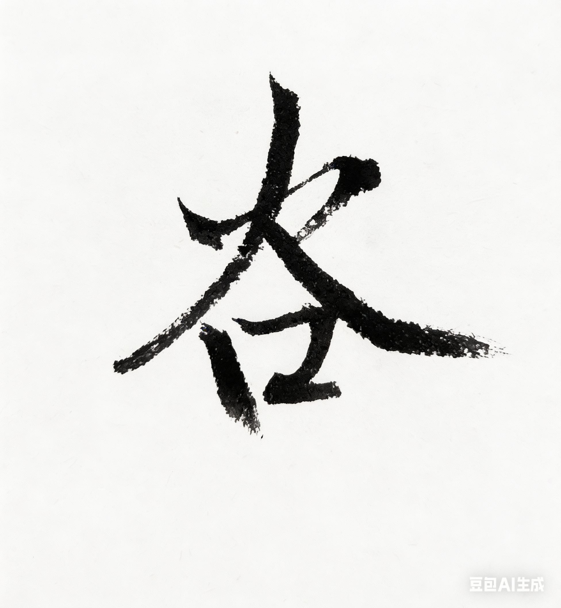

# Chapter 10: 谷 {-}

*谷歌、奥斯卡、优步*

> 谷里没有谷子，只有可能。
- 玄心

**tp_image**

{width=50% alpha=0.5}

## 广告

后来我去了硅谷。

刚到的时候，

我在谷歌的广告部门工作。

白天上班。

晚上上课。

那几年我在修国大的金融工程[^gu-nus-mfe]。

老师在新加坡。

我在加州。

很多课是晚上在线上课。

白天写代码。

晚上做作业。

有时候写到很晚。

\
硅谷的办公室很亮。

玻璃很多。

每个人桌上都有电脑。

有的人有两三块屏幕。

很多人穿T恤、牛仔裤，背着双肩包。

隔壁有个七十多岁的老头。

脾气和他写的代码一样火爆。

我很喜欢他的宠物狗。

他常常带狗来办公室上班，

然后给我狗粮喂他的狗，

这样就成了朋友。

\
也有些工程师看起来像高中生。

可他们讨论的事情却很大。

我之前在网易做过广告，

但是在谷歌，

他们已经把事情做到了另一个级别。

这里的系统，

面对的是全世界的用户。

真正的星球级别。

很多问题，

甚至只能用统计学的方法来解决。

广告系统每天处理海量的数据。

点击。

竞价。

排序。

模型。

很多决定在几毫秒里完成。

有时候我会觉得，

这些系统像一种新的工业机器。

不是钢铁做的机器。

而是代码做的机器。

## 医疗

后来我去了一家初创公司。

奥斯卡医疗。

那是Joshua Kushner[^gu-kushner]创办的公司。

我起初只知道他的超模女友，

还有他那位特有名的哥哥。

他本人很低调。

他很爱他的公司。

有次公司发生火灾。

大家往下冲的时候。

我看到他还在上面收拾东西。

我喊他快走。

他说你先下去吧。

等我们都冲到楼下，

过了很久，

他才从烟雾里面走出来。

\
公司里面文化很多元，

有男女共用的厕所。

有午休用的睡袋。

有穿比基尼写代码的耶鲁美女，

有穿西装打领带的哈佛帅哥。

有时候项目庆祝的时候，

公司突然变成了拉斯维加斯的赌场和酒吧。

我甚至好奇，

刚才那些办公桌都消失到哪里去了。

还有排队摸狗的福利。

说是抚摸小狗

能缓解焦虑。

\
公司里也有乒乓球台。

还有乒乓球比赛。

Joshua的球技不太好，

但毕竟是老板，

大家多少会让着一点。

我的球技只是业余水平。

为了提高球技，

我专门找了王晨来教我。

她是世界冠军，

美国奥运纪录保持者。

后来我们成了很好的朋友。

\
公司做医疗保险，

但很多工程师其实在做数据和算法。

也是在那里，

我第一次把AI运用在公司项目里。

那时候机器学习已经开始进入工程系统。

但还没有像后来那样，

成为整个行业的中心。

\
公司安排我去谷歌培训。

整整一周。

机器学习。

神经网络。

模型训练。

白天在教室听课。

晚上回去写代码练习。

很多东西我以前在数学和统计里见过。

但当它们真的在系统里运行时，

感觉完全不一样。

数据变成模型。

模型变成系统。

系统开始自己学习。

那时候我隐约感觉到，

这可能会改变很多行业。

## 交通

与此同时，

硅谷还有一家公司忽然变得非常热门：

优步。

一开始，

很多人只把它当成一个打车软件。

但很快大家发现，

它想做的事情远不止打车。

我想赶着上市前去优步。

可以发笔小财。

去面试那天我发现，

办公室里挤满了，

给我一样想法的求职者。

\
不知道怎么我被录取了。

那里也是很多年轻人。

不少斯坦福、哈佛毕业生。

也有各种奥赛奖牌得主。

隔壁还有个香港亚洲小姐选美冠军，

写的代码和她人一样漂亮。

但我更喜欢她的宝可梦玩具。

她常常在办公桌前，

一边写代码，

一边把玩那些小玩意。

\
更多的桌子上，

摆着电脑。

地图。

传感器。

我们谈论最多的一件事是：

自动驾驶。

车可以自己开。

我们做算法。

做传感器融合。

做路测。

在匹兹堡，

有时候一群人站在路边，

看着一辆测试车慢慢开过去。

车里没有人碰方向盘。

那一刻你会觉得，

有些事情真的在改变。

\
硅谷的节奏很快。

公司可以在几年之内长大。

资金一轮一轮进来。

工程师一批一批加入。

很多人都觉得，

自己正在参与某种历史。

\
后来优步上市了。

出租车行业也被重新洗牌。

办公楼下有人抗议的时候，

公司会发邮件让我们待在家里，

以免不测。

\
公司经历过很多起落。

但我一直记得那段时间。

你站在一个技术浪潮的正中间。

很多事情还没有发生。

但空气里已经有那种味道。

\
谷就是这样。

世界各地的人来到这里。

写代码。

或投资。

或创业。

然后把这些技术

带到世界的别的地方。

你不需要想做什么大事情，

有些浪潮来的时候，

你只是

刚好站在中间。

[^gu-kushner]: Joshua Kushner（1985—），美国投资人、创业者，Kushner Companies 与 Thrive Capital 创始人，奥斯卡医疗（Oscar Health）联合创始人；其兄 Jared Kushner 为特朗普执政时期白宫高级顾问；曾与超模 Karlie Kloss 结婚。

[^gu-nus-mfe]: 新加坡国立大学金融工程硕士（MFE）由风险管理研究所（RMI, Risk Management Institute）提供，需修满规定学分方可毕业。

