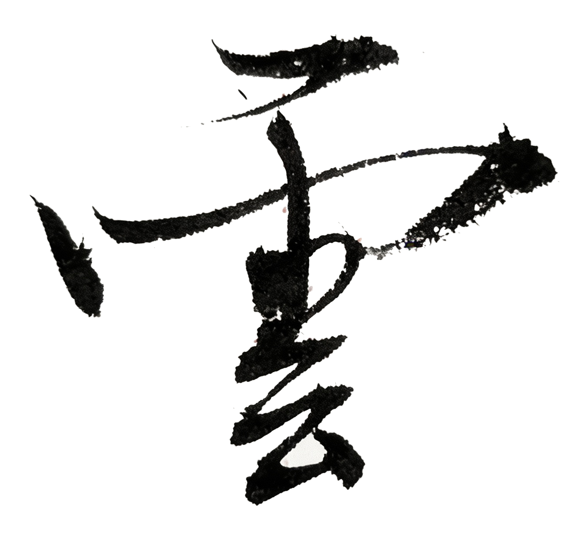

# Chapter 11: Cloud {-}

*From Uber to Oracle*

> The cloud is above; people are below.
- 玄心

**tp_image**

{width=100%}

## Choice

When I left Uber, the tide of autonomous driving was ebbing.

In the years before, the field had been white-hot; investment had poured in.

Back then many people thought the steering wheel would soon be a relic, that cars would drive themselves.

Until that accident.[^yun-uber]

That accident changed almost everything—regulation, investors’ attitude, companies’ plans.

Later the company decided to sell the entire self-driving business.[^yun-atg]

The feeling was hard to describe.

Something you thought you would keep doing suddenly became a bargaining chip on someone else’s table.

Over in a blink.

I had three very different choices in front of me.

I already had an offer from Apple, and half my former teammates had gone there.

A big bank had also extended an olive branch.

Several autonomous-vehicle companies kept calling.

Oracle was the least conspicuous.

Its stock had hovered around fifty dollars for over a decade, like a company the era had forgotten.

Someone asked me directly:

“That company is practically dead—what are you going there for?”

I didn’t answer.

But I went anyway.

The day of the interview I met a senior from my department.

We sat in a conference room; after the interview we went from our advisor to the shadows of trees on campus.

Many long-buried memories suddenly opened.

Later the hiring manager called almost every day.

That kind of invitation had a nearly naked sincerity.

Somehow I signed.

The night I signed I had trouble sleeping.

Sure enough, reality soon dealt me a blow.

The first week, the outdated systems and stifling atmosphere made me feel I could hardly breathe.

I even thought about jumping ship.

I called the HR at an autonomous-vehicle company I had once turned down.

I had once referred someone to them; she still owed me a referral fee.

I asked her:

“Can I still come to you now?”

There was silence on the line.

Then she said:

“Since you chose Oracle, it means you’ve already decided to retire.”

“Our values don’t align.”

The call ended.

In that moment the words felt like an insult.

I thought, since there was no way back, I would do the work to the extreme.

Even if it meant eighteen hours a day.

## MOGA

At the first meeting after I joined, everyone was to introduce themselves and say why they had joined Oracle.

Trump had just left office, but his slogan was still in the air.

I said at the meeting that I had joined to make Oracle great again.[^yun-maga]

One engineer can’t change a company.

That was my wish.

I even put that line first in my social-media bio.

I don’t know if anyone took it seriously then.

Later many things slowly happened.

Sometimes when you put down roots in the most unlikely place,

you find things begin to change.

Oracle’s stock began to climb.

Looking back two years later, that curve had multiplied several times over.

Later it kept climbing.

Until one day we suddenly realized—

the company’s founder had been pushed by that rise to become the world’s richest person.[^yun-oracle]

The world’s richest person is also an ordinary person.

Only the energy seems a bit different.

I’ve seen him when he was nearly eighty.

When he talked about cloud computing and the technological shift of large models, his eyes were still sharp.

Technology is changing.

Machines are starting to do what only humans could do before.

Write code.

Write documents.

Think.

In 2022 I was thinking: if machines can think too, why should people still work?

That used to be a philosophical question.

Now it’s an engineering question you face every day.

Later at Oracle I began working on AI architecture in the cloud and training AI models.

Every day trying to find an answer.

In the data center, the blue lights of servers flicker row after row.

The sound of fans like a distant sea.

## ChatGPT

Before ChatGPT exploded I had already been tinkering with those huge language models.

By then some models were already hot in the open-source community.

That heat was quiet and yet feverish.

I casually put a repo on GitHub;

stars passed a thousand quickly.

My inbox was full—doctors, lawyers, students, even farmers.

Someone even said they would drive over to learn from me.

That fervor made me feel a touch of fear.

In January 2023, ChatGPT unexpectedly went viral.

I had been playing with this for a long time; to me it wasn’t unexpected at all.

I stood outside the server room with one thought in my head:

The inflection point for technology has come.

Many of the systems we had built might have to be torn down and rebuilt.

Later I began working on Copilot.

Officially an assistant for programmers.

But I knew in my heart what its real aim was.

Sometimes I looked at my colleagues.

From my perspective they slowly grew blurry.

Became cold lines of Transformer code.

Once I tested a new system.

The data showed it could complete 70% of junior development work.

The team cheered.

Through the champagne bubbles I suddenly thought of something.

If the system can complete 70% of development tasks,

does that also mean—

soon 70% of people will disappear?

What we’re doing is a bit like digging a hole.

And to avoid being buried by the era we have to dig faster than everyone else.

Sometimes I think of a piece of calligraphy I saw long ago.

In a small office in Guangzhou.

Those five characters:

“Above the clouds there is no wind or rain.”

The cloud is overhead.

Code is in the middle.

We are making a storm.

And below the cloud

people are still walking as before.

Only no one knows

where this road leads.

[^yun-uber]: In March 2018, an Uber self-driving test vehicle struck and killed a pedestrian in Tempe, Arizona, the world’s first fatal autonomous-driving accident; regulation tightened thereafter and Uber sold its self-driving unit to Aurora.

[^yun-atg]: In 2020, Uber sold its autonomous driving business (ATG) to Aurora.

[^yun-maga]: Trump’s campaign and presidency slogan “Make America Great Again,” abbreviated MAGA.

[^yun-oracle]: Oracle’s stock rose sharply on the back of AI and cloud business; founder Larry Ellison briefly surpassed Musk as the world’s richest person.
