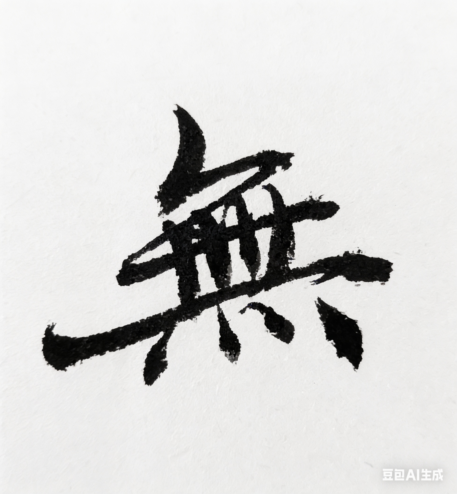

# Chapter 12: 无 {-}

*无风，无雨、无常、无虚*

> 无，不是没有，是空出来。
- 玄心

**tp_image**

{width=70%}

## 存在

我写代码写了很多年。

从高中的微机课开始。

那时候代码是人写的。

一行一行。

有时候写到很晚。

屏幕亮着，

办公室很安静，

只听见键盘的声音。

\
不知道什么时候，

机器也开始写代码。

一开始只是自动补全。

后来，

一整段程序都可以自动写出来。

再后来，

整个项目都可以自动生成。

很多人开始问一个问题：

程序员还会不会存在。

\
有一天我忽然觉得，

也许我可以停一下。

不是因为累。

只是因为路走到这里。

机器已经能写。

人不一定非要再写。

\
那段时间我开始做别的事情。

读书。

写一点东西。

也去看一些很久没见的人。

有时候我会想起，

很早以前的一些人。

山里的泉水。

溪里的螃蟹。

那块后来被人搬走的石头。

也会想起广州的一间办公室。

墙上挂着一幅字：

云层之上无风雨。

\
这几年

爸妈老得很快。

人忽然会开始想，

一些以前没有认真想过的事情。

人会老。

时间会过去。

很多东西都会离开。

有一天你会发现，

青春不见了。

亲人离开了。

很多事情也不再重要。

那时候人会问：

生命到底有什么意义。

\
我没有答案。

也许很多人都没有答案。

但我知道一件事。

从山里的泥。

到墙上的字，

到电脑里的代码。

再从代码，

到人工智能。

这条路一直在变。

\
也许有一天，

人不必再写代码，

甚至不必再工作。

没准不是坏事。

也许有一天，

AI 接管了逻辑。

人才有空，

去完整地

做回一个“有情众生”。

\
关掉显示器。

去给母亲剥一个橘子。

或者陪父亲

看一会儿窗外的天空。

这些事情，

AI永远算不出来。

\
最近我常读苏轼的《定风波》。

“莫听穿林打叶声。

何妨吟啸且徐行。

竹杖芒鞋轻胜马。

谁怕？

一蓑烟雨任平生。”

午后的阳光，

山里的雾气，

其实并没有什么分别。

路

就在脚下。

