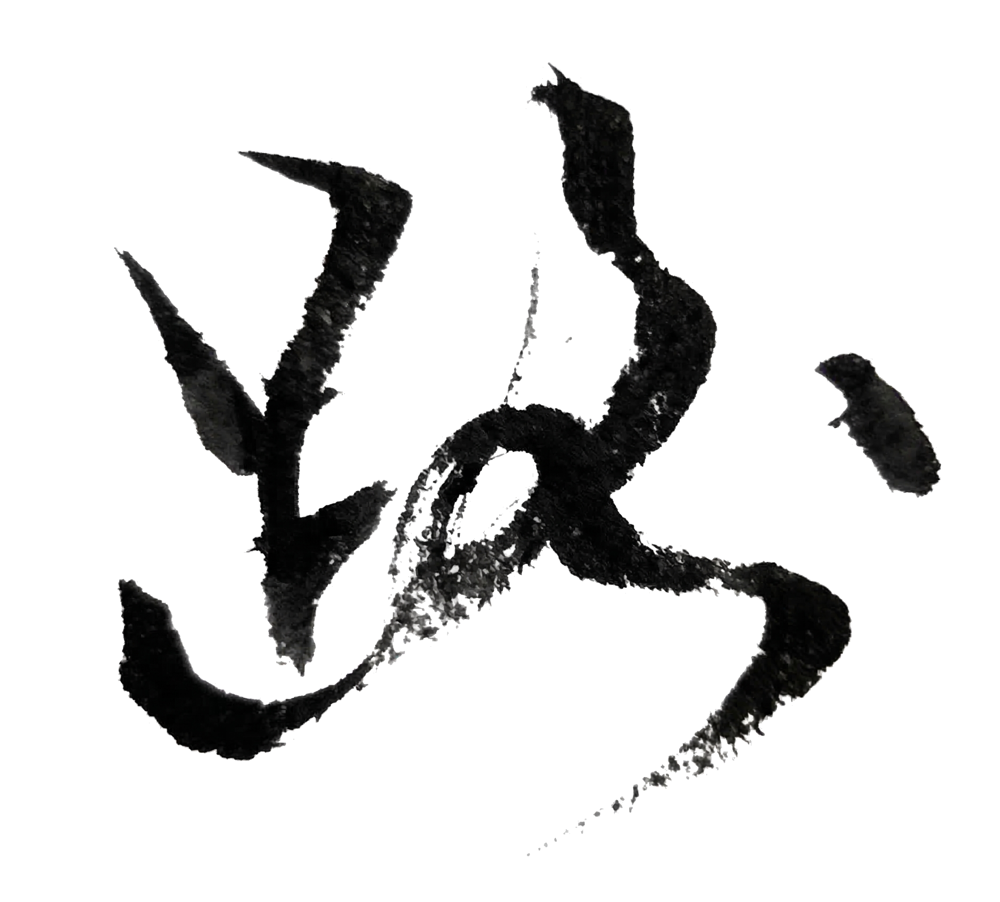

# Chapter 2: 路 {-}

*小学到初中，与天才同学争第一*

> 路是走出来的。
- 玄心居士

**tp_image**

{width=100%}

从小学到初中，我几乎总是考第二。第一永远是他。

他是我同班同学。

一个小学三年级就读完《红楼梦》，还能背的人。

一个学象棋一个星期，就能和镇上几十年的老棋手下成平手的人。

一个不需要怎么读书就能考满分的人。

数学老师特别喜欢叫他上黑板解题，我们还没看明白题目，他已经写完了。

那时候我很佩服他。

也想过，如果我有他的脑子就好了。

我们那里没有“天才”这个词，大家只说，他聪明。

我是那个努力的——努力的可以考第二，但考不过聪明的。

有一年夏天，期末考试发成绩。

教室里很安静。窗外的蝉已经开始叫。

所有人都在等班主任进来。

在我们那个小镇的中学里，成绩几乎决定一切。

我坐在第三排，前面是他。

班主任走进来，手里拿着一叠卷子，站在讲台上说：

“这次考试，成绩出来了。”

教室更安静了。

我们班的习惯是先念前十名。

班主任翻开名单，念了第一个名字。

果然还是他。

没有人惊讶，好像这是理所当然的事情。

他站起来，走到讲台前拿卷子，动作很自然。

然后班主任念第二名。

是我。

我走上去的时候，看了一眼他的分数。

比我高四分。

就差四分。

回到座位，我心里想，下一次，也许可以超过他。

从小学我就开始我就这么想。

这么多年一直没实现过。

但我还是会这么想。

发完成绩，放学以后，我们走同一条路回家。

那是一条土路，从学校门口一直通到我们村。

晴天是灰的，雨天是泥的。

路两边有时是田，有时是坡，有时什么也没有，只有草。

我背着书包走在路上。

有时候他走在前面。

有时候我一个人。

我常常想一件事。

为什么赢不了。

不是不服气，就是不明白。

我明明也做了题，也听了课，也把那些题多算了几遍。

为什么他不用这么费劲就能考第一？

路很长。

我就在那条土路上，一遍一遍地想。

難道是他後腦勺比我大?

没有人可以问。

问老师？问父母？问他？

我们不怎么说话。

他不是骄傲，就是话少。

我只是想赢他一次。

一次就好。

从来没有赢过。

小学没有。

初一也没有。

其实我们关系很好。

一起斗鸡。

一起集邮。

他话不多。

但放学以后，我们常常站在路边聊很久。

有时候聊历史。

有时候聊很远的事情。

有一次我们在那条土路上讨论一个问题。

宇宙是不是有限的。

他说不是。

他说宇宙是无限的。

我想了很久。

还是想不明白。

在我看来，人的生命是有限的。

树会长大，也会死。

河水会流走。

路也会走到头。

既然这样，宇宙怎么会是无限的。

他笑了一下，没有再解释。

后来到初二，他转学了。

听说是因为他爸工作调动。

从那以后，我们不再一起回家。

那条土路，也只剩我一个人走。

再后来，到了中考那个夏天。

我们走上了不同的路。

他考上了中专。

家里觉得早点出来工作好，更稳。

我落榜了。

后来才知道是内招名额的事，当时不知道。

阴差阳错，我进了重点高中。

那时候农村的孩子，很多人都想考师范、考中专，早点出来工作赚钱。

去读高中，反而被人觉得可惜。

两条完全不同的路。

他更早进入社会。

下海打工。

后来又回到了体制内。

经历了很多事。

据说也被人骗过。

甚至有人说，他被装进麻袋卖去了南方。

我觉得不可思议。

也许只是个传闻。

我上了高中。

那几年，我们还通信。

写信的时候，我們用古文。

有时候也会寄照片。

信里说的，多半是将来的事。

后来我上了大学，然后出国。

慢慢地，我们走上了不同的路。

很多年以后，我回老家。

镇上的街道和记忆里差不多，只是比以前更窄了一点。

小时候觉得很大的地方，现在走几步就到了尽头。

我想见他一面。

托一个老同学帮忙联系，说很多年没见了，想一起吃个饭。

老同学沉默了一会儿，说帮我问问。

那天晚上我收到回话。

他说，他不见了。

老同学解释得很小心。

他说大家都这么多年没联系了，就算了。

我没有生气。

只是忽然有一点说不清的感觉。

好像有一扇门，在很久以前就已经关上了。

只是我今天才发现。

后来我一个人走到中学门口。

学校已经放学，操场很安静。

我站在铁门外，看着那栋旧教学楼。

很多年前，我们在那里争第一名。

我忽然意识到，我真正想见的也许并不是现在的他。

而是那个站在黑板前、总是第一名的少年。

可那个世界，早就已经过去了。

那条土路，我们曾经一起走过很多遍。

他走在前面，我走在后面。

我一直在想，为什么赢不了。

那条路现在也许还在。

只是走路的人已经散了。

