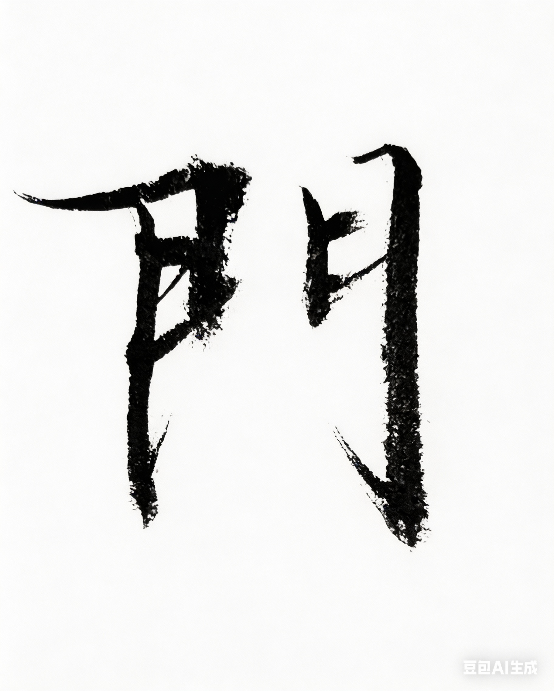

# Chapter 3: 门 {-}

*中考落榜、鲤鱼跃龙门*

> 有些门，一生只开一次。
- 玄心居士

**tp_image**

{width=70%}

## 落榜

中考放榜那天，我心裏很忐忑。

爸妈想让我读中专或师范，早点出来工作，家里也轻松一点。

我心里想读大学，但没说。

我的分数在我们那几个区里都是最高的，高出第二名几十分。

但是，我落榜了。

\
我們後來知道，我報考的那幾個學校，

在全省只招一两个人，而且都是是内招。

我父母不是系統內部員工，所以我沒有資格。

当时大家都觉得完了。

我心里却还想，也许还能读高中。

但因为等中专的录取通知，我错过了高中的录取时间。

结果中专没录取，高中也过了。

一下子，没有书读了。

后来我爸說，實在不行就去和豐中學.

雖然是普通高中，每年還是有幾個能考進大學的。

我苦笑了一下，也不知道该说什么。

再后来有个消息说，简阳中学也許还能进。

那是我們市的省重點中學。

但是名额已经满了，要进得再交一笔钱，一千多块。

对我们家来说，那是一大笔钱。

我们拿不出来。

那段时间家里气氛很沉。

飯擺在桌子上都涼了也不見爸吃。

好像路已经断了。

## 校門

我爸那時候幾天不在家。

媽說他在外面到處找人借錢。

借錢哪有那麼簡單？

我告訴我妈，

快叫爸回来吧，

實在不行，我就去上普通高中。

那幾天感覺像過了半年。

终于有了新消息。

我爸有个同学。

她的丈夫当时在简阳中学建新校门，工地上管钱。

后来不知道他们怎么说的。

那笔建校门的钱里，拿出了一千块。

说是奖学金。

\
我就这样进了简阳中学。

进去以后才知道，

我其实是全市第二名，班里的第一。

只是当时，

是以“落榜生”的名义，交了一笔额外的钱，才跨进那道门。

\
我们那里有个说法：

进了简阳中学，就等于半只脚进了大学。

对寒门子弟来说，那是一道门。

门里面，是另一种可能。

门外面，是小镇和庄稼。

\
后来我常常经过那道校门。

每次都会想起那一千块钱。

那扇门是给很多人修的。

但那一年，

有一块砖，是留给我的。

