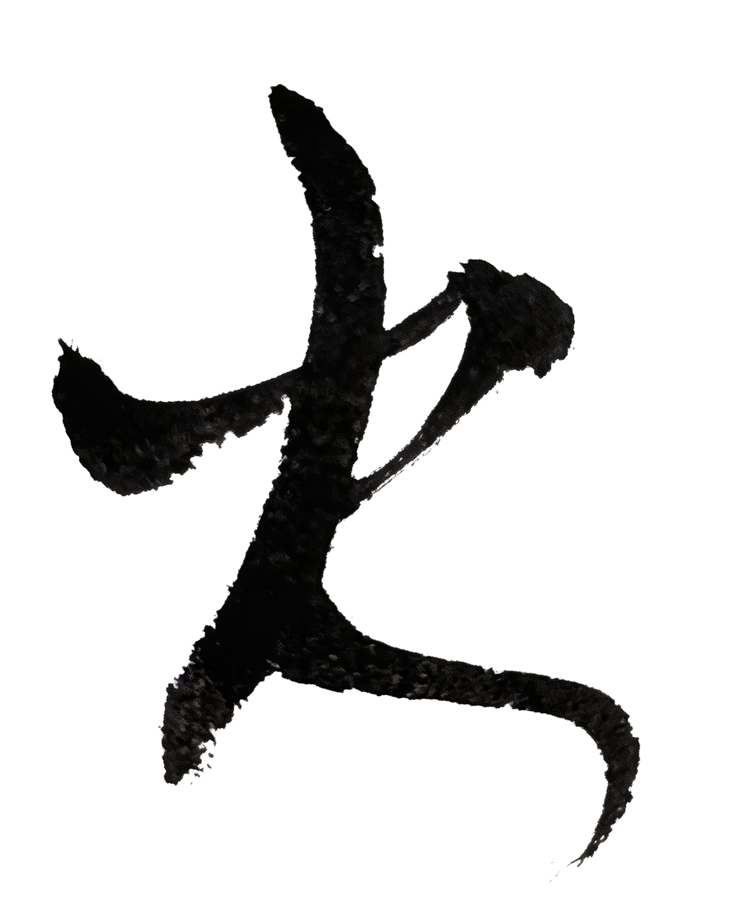

# Chapter 4: 火 {-}

*艺体节、海底捞*

> 火从很小的地方开始。
- 玄心

**tp_image**

{width=60%}

## 篝火

进入高中后不久，

我发现同学之间差异蛮大的。

城市里的同学很放得开。

我从山里出来的，

总有点拘谨。

有些事情他们觉得很自然。

我却不知道该把眼睛放在哪里。

他们也慢慢发现了这一点。

于是常常拿我开玩笑。

那时候我脸很容易红。

现在想起来，其实也没什么。

\
我学习很努力。

作为班上第一名，

大家都看着你。

不但有老师，

有同学，

还有同学的爸妈。

我甚至觉得以前当第二名更好。

压力没那么大。

画画和唱歌都停了。

我这么喜欢唱歌的人，

高中三年却没哼过一声。

连同寝室的人都不知道。

学校每年都有艺体节。

有一次，

我想去报名唱歌。

后来想想，

要考大学，

考大学又不考唱歌。

还是没报。

\
那天晚上，

广场上点起了一堆很大的篝火。

火很高。

同学们围着火堆唱歌、跳舞。

有人在喊。

有人在笑。

火光一闪一闪地照在脸上。

我站在人群外面，

看着那堆火。

看了一会儿。

然后悄悄回宿舍自习。

## 火锅

高一那年，

所有大考，

我都是全年级第一。

学校是全市最好的，

所以差不多也是全市第一。

在我们那里，

这叫状元。

我在学校挺火的，

经常被叫去其他班传授学习经验。

同学也喜欢和我说话，

找我问问题。

我记得当时下午大扫除，

灰尘弥漫整个教室。

我在给一个同学讲题。

班主任进来说，

“这么大灰尘了，

赶快出来吧。”

我们还是没动。

同学说，

他家是四川拖拉机厂的。

我说我暑假刚去过。

我爸有个同学，

在那儿当老师。

\
每次考完，

我会被带去改善生活，

就找一家馆子吃点好的。

有时候是爸妈或者亲戚带我去。

有时候，

玩得好的同学的爸妈也会把我一起带去。

有时候吃羊肉汤，

更多的时候是吃火锅。

去得最多的是一家。

名字叫海底捞。

\
店不大。

老板亲自招呼客人，

很热情。

刚坐下他就端茶倒水，

问要不要加菜。

吃完要走的时候，

店员会站在门口送客。

在那个小市里，

这样的礼数并不多见。

老板据说是四川拖拉机厂出来的，

国有企业不景气，

他下海做生意。

他有个老师还是我爸的同班同学。

那时候我是状元。

他是川拖技校毕业的。

在很多人眼里，

他不算读书人。

我们在店里吃火锅，

他在店里忙前忙后。

店不大。

味道却很好。

\
那时候，

我少有吃到这么好吃的东西。

我特别喜欢吃莲藕，

还有牛肉。

这么多年过去，

那个味道好像还留在嘴边。

那条街不长。

那几年，我们去过几次。

老板记性很好，也很会看人。

我想，也许他也记得我们。

有一次我进门，他笑着问：

“这次考得怎么样？”

我说还行。

他说：

“那就多吃点。”

考卷、排名、晚自习。

还有考完之后的一顿火锅。

那几年，大概就是这样过来的。

\
后来考试越来越多，

我的年级排名变来变去。

那家火锅店的生意却越来越好。

后来我上了大学，

离开了那个小城。

再后来出国，

又回来，

又出去。

很多年没有再见过他。

我几乎已经忘记了。

\
再听到"海底捞"这个名字，

是十多年以后。

有人说，

他的生意已经做得很大。

后来我才知道，

那家店，

已经开遍了全世界。

只是那条街，

我已经很久没有再走过。

