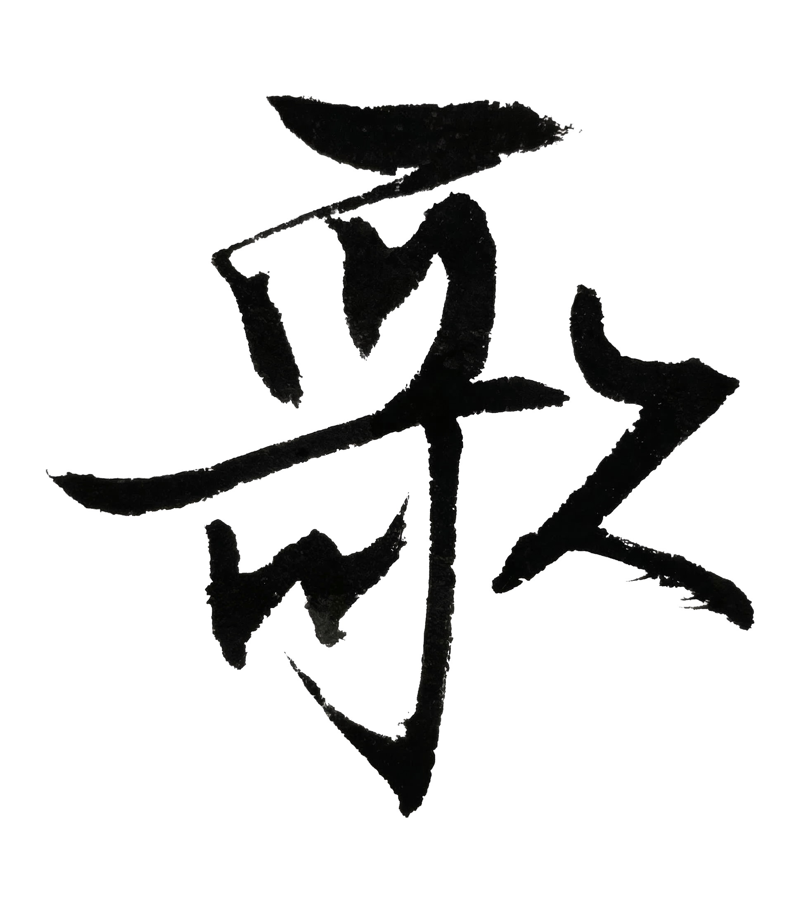

# Chapter 5: 歌 {-}

*大学、合唱团*

> 人会忘记很多事。但有些声音，会留一辈子。
- 玄心

**tp_image**

{width=50% alpha=0.5}

## 大学

高中三年很快结束了。

我考进了北京的一个有名的工科大学。

去北京的火车上，

有人给我让座。

说来了个名校大学生。

我谢绝了他的好意。

毕竟那车要做十几个小时。

这个专业在四川招三个人，

我就是其中一个。

算是一种缘分。

\
大学里，

我学习依然刻苦。

我很少去玩。

直到今天，

我都还没去过长城。

但我开始慢慢放开自己。

生活不只有课本。

我还写字。

画画。

弹吉它。

还有唱歌。

周末甚至会去人民大学，

看电影喝啤酒，

交些朋友，

吹吹自己不懂的经济学和社会学。

那时候我觉得,

一个人只要还能做这些事。

日子就不算太坏。

\
我开始在一些社团打杂。

有一天，

一个叫卢庚戌[^ge-lu]的人找到了社团，

说要在学校开演唱会。

我被派去给他搬东西。

他就站在楼下。

戴一顶很大的帽子。

旁边放着一叠海报。

我蹲在地上帮他搬桌子和音箱。

那时候我心想——

原来开演唱会的人，

看起来也和普通人差不多。

\
过了不久，

还有个名字很怪的组合叫羽泉[^ge-yuquan]。

也说要来开演唱会。

我还是被派去打杂。

那年夏天我剃了个光头。

他们在台前唱歌，

我在后台搬东西，

来回跑。

后来同学跟我说：

“今天演唱会我看到你了。”

我说：“我又没上台。”

他说：

“我看到后台有个光头一直在晃。”

嗯。

那大概就是我。

\
后来我创立了美术学会和书法协会。

说是“创立”，

其实也没有后来人想象得那么郑重。

不过是找几个同样有兴趣的人。

借一间教室，写几张通知，

再想办法把这件事撑下去。

虽然是名校，

但对学生来说，

很多事情还是要自己张罗。

社团可以办。

经费却几乎没有。

活动可以做，

但场地要自己借，

海报要自己写，

事情要自己跑。

我那时喜欢折腾这些。

学校的资源大多在科研上。

学生社团能拿到的东西其实不多。

别人暑假回家。

我留在学校打工。

天热得很，

校园里空空荡荡，

树叶一动不动，

只有知了在叫。

我白天干活，

晚上回宿舍写字、画画。

那时候我总觉得，

青春并不是轰轰烈烈的东西。

青春更像一间空教室。

黄昏的光照进来，

黑板上还有没擦干净的粉笔字。

你一个人站在里面，

觉得自己将来好像什么都能做，

又好像什么都抓不住。

## 试唱

记不得哪天了，

有人问我，

要不要去北京大学生合唱团试唱。

我知道这个团，很有名。

我答应了。

但我心里没什么底。

\
我从小就会唱歌。

平常听见喜欢的歌，

就跟着唱。

镇上有文艺比赛，

我被拉上去，

随便唱了几句，

也不知道怎么就拿了奖。

有天在土路上走的时候，

我发现我会模仿蒋大为的声音。

刘德华的歌听起来很不同，

但模仿起来更容易。

我还会点简谱，

但我不认识五线谱。

高音上得去，

低音也不算太虚.

仅此而已。

\
试唱那天，

屋里坐着几个人。

有记名字的，

还有两个负责听和写的人。

轮到我的时候，

我轻轻站到钢琴旁边。

我说我不会五线谱，

说完忽然觉得喉咙有点发紧。

团长是一个英语系的女生，

坐在钢琴前。

窗户开着，

风吹进来，

把谱子边角吹得轻轻动。

她说没关系，

然后问我唱什么。

我说，《敖包相会》。

她点了点头，

手落在琴键上，

给我起了个音。

我就开始唱。

一开始有点紧。

唱到高一点的地方，

我放开了些。

那种感觉我后来常常记得：

前面一个音符还像是在试探，

到了后面，

高音一出去，

人反而不紧张了。

\
我唱完以后，

房间里安静了一下。

副团长先开口，

说，“不行”。

他说得很直接：

“不会看谱，不太行。”

我站在那里，

脸有点热，

也不知该说什么。

我已经准备转身走了。

\
团长看了我一会儿，说了一句：

“高音还不错。”

然后她说，

“留下吧”。

我后来想，

一个人的命运有时候真的很奇怪。

不是谁说了很多话，

也不是发生了什么大事。

只是有人在你快要被划掉的时候，

说了一句：

“留下吧。”

我就这样进了合唱团。

\
好巧不巧，

后来我才发现，

团长是我美术课的同学。

有一次上课，

她来得晚。

教室里几乎已经坐满了。

我旁边正好还有一个位子。

我把凳子让给她。

她一开始不肯坐。

我说：

“你太高了。

站着的话，

后面同学看不见黑板。”

她这才坐下。

她喜欢画一些卡通人物。

有时候也翘课。

我就帮她收老师批改过的画作。

有时候我们也聊几句。

我问的，

都是粉丝问歌星的那种问题。

比如：

什么时候出下一张专辑？

上一张CD在哪里能买到？

她说，

第一张专辑其实是磁带，

名字叫做

《世上只有妈妈好》。

是给电影配主题歌唱的。

我知道，

小学的时候,

学校组织看过那个电影，

我说“那个不是台湾电影吗？”

她说大陆版是她唱的。

我问她，

为什么还要来上课，

不去当歌星。

她说，

爸妈在总政歌舞团。

家里不让她走这条路。

后来团里的人告诉我，

她是音乐世家出身。

她干妈也是很有名的歌唱家。

那些流行歌，

对她来说，

其实都太简单。

\
她长得很好看。

是那种学校里公认的校花。

平时话不多，也不怎么笑，

和人保持着一种自然的距离。

可她一坐到钢琴前，

整个人又不一样了。

她弹琴的时候很安静。

不是没有声音，

而是她会把周围的杂乱都压下去。

我们一排一排站在她身后，

跟着她的琴声进、

跟着她的琴声停。

有时候她抬头听某个声部，

眉头微微皱一下;

有时候觉得对了，

也不夸，

只轻轻点个头。

我站在人群里，

看她的背影，

看她的手，

看钢琴上来回跳动的光,

忽然觉得，

美原来可以这样流动出来。

\
但我在合唱团里，

其实并不属于那种“标准团员”。

我不识谱。

别人拿到谱子，

会先低头看旋律线。

我只能靠听，

靠记，

靠跟。

别人看着纸唱，

我看着别人唱。

副团长还是不太喜欢我这一路子。

\
有一次排练，

团长让我们单独唱一段。

别人唱完，

她点点头，

到我这里，

她皱了皱眉。

你还是不认谱。

我说，是。

她说，你这样很吃亏。

我没反驳。

因为她说得对。

\
排练的教室，

一般都在主南125。

据说很多年前，

彭德怀也在这里站过。

排练多的时候，

一周要去好几次。

教室里常有一股木头、纸张和旧琴漆混在一起的味道。

夏天热，

男生后背一会儿就湿。

冬天冷，

大家跺着脚等开始。

对我来说，

歌就是出口。

写字是一个人的事，

画画也是一个人的事，

只有唱歌不是。

唱歌的时候，

你站在人群里，

声音从胸腔里出来，

和别人的声音叠在一起，

忽然就不再只是你自己的了。

\
有时候排练结束，

天已经黑了。

我们从教室出来，

楼道里空荡荡的，

远处的灯一盏一盏亮着。

我背着书包慢慢往宿舍走，

风从操场那边吹过来，

带一点夜里的凉气。

那时候我常常觉得，

人生如果就这样一直下去，

好像也没什么不好。

有时候去教室排练唱歌，

有时候在宿舍里写字画画。

未来在哪里，

并不清楚。

但每一天都还能被某种东西照亮。

\
我后来还学过一点美声。

那已经是很多年以后，

在硅谷，

我跟一位歌唱家学过一段时间。

那时候我唱的，

是《我的太阳》那种意大利风格的。

那种歌和《敖包相会》完全不是一个路子。

气不是往胸口压，

而是往脸前面送。

但我回头想起“歌”这件事。

最先想起的，

还是大学里那个不认识五线谱的自己。

想起试唱那天。

副团长说不行。

团长却说高音还不错。

我就被留下来了。

\
现在回头看，

年轻时的很多尊严，

其实都很脆弱。

一句否定，能让你立刻低下头。

一句肯定，也足够让你记很多年。

那时候我也会看团长。

不是那种真能走上前去说什么的看法，

只是远远地看。

看她弹琴，

看她低头翻谱，

看她把散下来的头发轻轻拨到耳后。

后来回想起来，

她更像青春里的一个象征。

好看。

安静。

遥远。

留下来的，

是钢琴声。

是站在她身后，

一排排跟着唱的那些傍晚。

是窗外快要暗下去的天色。

是某个高音上去以后，

心里忽然亮了一下。

是钢琴轻轻响起的时候，

琴弦在空气里微微震动的声音。

\
大学毕业以后，

很多事都散了。

社团会散。

人会走。

琴弦松了会换。

琴房会换别人进去。

可歌没有完全散。

它留在嗓子里。

也留在记忆里。

青春大概就是这样。

你并不真正拥有什么。

却会因为一个社团、一首歌、一个高音、

一个坐在钢琴前的背影，

觉得自己已经拥有了整个世界。

[^ge-lu]: 卢庚戌（1970—），清华大学建筑系毕业，歌手、音乐人。2001 年与李健组建水木年华，担任主唱及创作，《一生有你》《在他乡》等歌曲广为传唱；后李健单飞，水木年华成员几经更迭，卢庚戌持续以水木年华名义创作与演出。

[^ge-yuquan]: 羽泉，中国内地流行音乐组合，由陈羽凡与胡海泉组成，1998 年成立。
