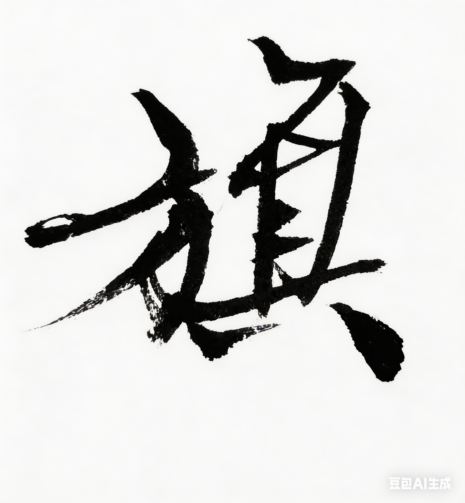

# Chapter 6: 旗 {-}

*国庆、天安门*

> 旗在风里，人在队伍里。
- 玄心

**tp_image**

{width=70%}

## 国庆

一九九九年，国庆。

那一年，北京很热闹。

建国五十周年。

要举行阅兵和群众游行。

学校接到通知。

要组织学生方阵。

我被选进了队伍。

最开始只是训练。

每天排队形。
练步伐。
练口号。

操场上画着白线。

我们一排一排站好。

老师拿着哨子。

在前面喊节奏。

脚步要整齐。
胳膊要摆到同一个高度。

队形要像一块移动的方阵。

太阳很大。

操场的地面被晒得发白。

我们一遍一遍走。

汗从额头往下流。

衣服后背很快湿透。

有人会小声抱怨。

说走这么多遍到底有什么用。

但第二天。

还是照样来。

后来训练的地方换到了北京郊外。

有时候在昌平。

有时候在大兴。

每天很早出发。

大巴从学校门口开出去。

一路往城外走。

楼慢慢变少。

路变得更宽。

车里的人一开始还聊天。

后来大多靠在座位上睡着了。

操场很大。

地面被太阳晒得发白。

我们按照地上的白线练步伐。

老师在前面吹哨子。

喊节奏。

脚步要整齐。

胳膊要摆到同一个高度。

太阳很毒。

练一会儿。

衣服就湿透了。

有人会小声抱怨。

但第二天。

还是照样来。

那时候。

我们其实不知道自己在准备什么。

只知道。

要把队伍走整齐。

与此同时。

\
学校的合唱团也在准备国庆活动。

我正好在合唱团。

所以有时候。

上午练方阵。

下午去礼堂排合唱。

礼堂很安静。

钢琴摆在台上。

一排一排人站在后面。

我们已经排过很多次合唱。

站位、呼吸、进声。

都比较熟。

学校请人来指导。

\
有一次。

来了一个特别有名的唱歌家。

我上小学的时候，

每天早上广播里，

都会定时放一首歌，

叫《在希望的田野上》。

就是她唱的。

漫山遍野都听得到。

那时候没有闹钟，

那首歌

就是叫我起床的闹钟。

她来的时候。

整个礼堂忽然安静下来。

她站在台前。

没有什么架子。

说话很温和。

先听我们唱了一段。

然后慢慢讲哪里要收一点。

哪里要放一点。

她说话不快。

但每一句都很清楚。

她一边说。

一边用手轻轻打拍子。

让我们跟着唱。

我站在队伍里。

看着台上的人。

心里有一点恍惚。

我以前只在电视里见过她。

突然有一天。

她站在你面前。

像一个普通老师一样。

给你纠正节奏。

/
团长站在钢琴旁边。

她安静地弹琴。

平时在学校里。

她已经是那种有点遥远的人。

到了这种场合。

她更像是另一个世界的人。

我们站在她后面。

一排一排唱。

琴声在礼堂里回响。

声音慢慢叠在一起。

那一刻我忽然觉得。

很多原本分散的人和事。

好像被一条看不见的线

连在了一起。

\

国庆游行的训练断断续续，

但持续了很久。

后来。

我们真的去了天安门广场附近排练。

不止一次。

去了好几次。

有时候轮到别的学校彩排。

我们就在旁边等场地。

队伍坐在路边。

有人喝水。

有人靠在背包上。

也有人什么都不说。

就那样看着广场。

天安门城楼在远处。

红墙。

黄瓦。

阳光落在上面。

广场很大。

风从长安街那边吹过来。

等得久了。

大家就开始聊天。

我和系里合唱团的几个同学坐在一起。

也没什么事干。

就一人一句唱歌。

唱的不是排练的歌。

是流行歌。

「最近比较烦。」

有人唱一句。

另一个人接一句。

慢慢几个人都跟着唱。

声音不大。

像是在聊天。

那时候。

我们好像总觉得自己有很多烦恼。

功课。

未来。

还有很多说不清的事情。

很多年以后。

我才慢慢明白。

其实那段时间。

是人生最不烦的时候。

## 检阅

真正游行那天。

天很晴。

阳光照在街上。

路面微微发亮。

我们站在队伍里。

等着轮到自己的那一段。

远处有音乐声。

不是一首歌。

而是一整片声音。

从很远的地方传过来。

广播里不时传来指挥的声音。

队伍站在那里。

一排一排。

大家都没有说话。

后来。

江主席来检阅我们。

队伍一下子更安静了。

我站在里面。

看着他慢慢经过。

比我想象中更魁梧一些。

脸其实看不太清。

但我知道。

那就是国家领导人。

阳光从上面照下来。

影子落在地面上。

队伍没有动。

每个人都站得很直。

所有事情都像被一种巨大的节奏定在那里。

旗在风里。

人在人群里。

长安街很长。

那一刻我忽然意识到一件事。

电视里看到的画面。

现在就在自己眼前。

那条街。

那些旗。

那些人。

都是真的。

我们从城楼前走过去。

队伍继续往前。

音乐声渐渐远了。

人群的声音也慢慢散开。

等到整个方阵走完。

大家才松了一口气。

有人悄悄笑。

有人小声说话。

还有人回头看刚才走过的地方。

那一刻没有人说什么大词。

也没有人讨论历史。

我们只是觉得。

自己刚刚参与了一件很大的事情。

很多年以后。

我还会想起那一天。

不是想起口号。

也不是想起电视里的画面。

我记得的是阳光。

记得长安街很宽。

记得脚步声在地面上一排一排连起来。

记得红旗在风里动。

也记得自己站在队伍里。

忽然有一种很奇怪的感觉。

国家。

时代。

自己。

好像被一条看不见的线串在了一起。

那时候我才第一次隐约明白。

一个人的青春。

并不只属于自己。

有时候。

它也属于那个时代。
