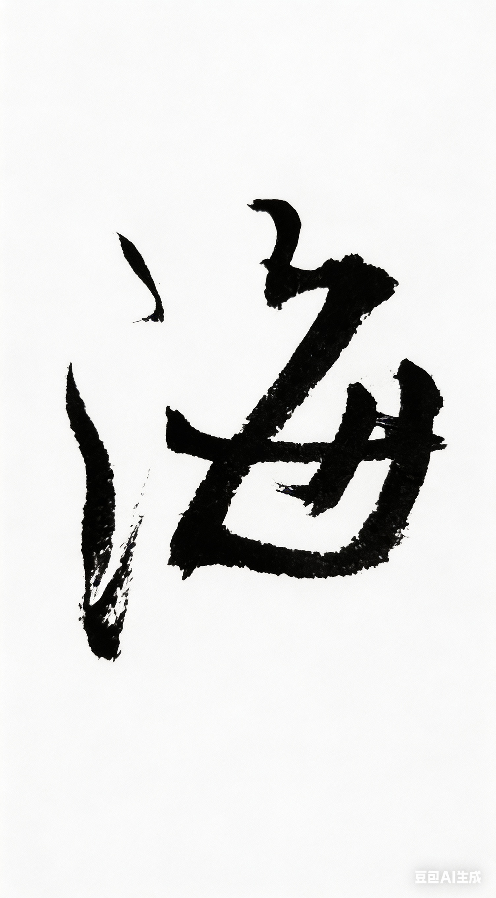

# Chapter 7: 海 {-}

*出国、新加坡、托福 GRE、MIT/SMA*

> 海的那边，是另一种人生。
- 玄心

**tp_image**

{width=50%}

## 家教

我第一次真正跨越大海，

是大学毕业以后。

那之前，我一直在北京读书。

学校在国内算是很好的工科大学。

很多人以为，

能考进这样的学校，日子就会很顺。

其实不一定。

\
我读书的时候，家里没有什么钱。

北京生活不便宜。

吃饭、穿衣、书本、文具，

每一件事情都要算。

寒暑假的时候，

别人回家，我就留在北京打工。

可以把回家的车费省下来。

第一个寒假，

我在宿舍看门，

挣了700块。

这样家里负担就轻了700块。

我接过很多零碎的工作。

家教，写字，画画。

\
有次家教是给一个小女孩补课。

说好了一个小时三十块。

她爸爸却只给我二十.

他说开出租很难赚。

我看他的屋子门都破了，

为了女儿，

他的日子过得比我爸还抠。

收了二十算了。

大家都不容易。

\
也有人大附中的家教。

家里很豪华很宽畅。

一个小时两百八十块。

这让我当时破了系里家教时薪的记录。

指导员人很好。

帮我联系了些活儿。

比如给出版社设计封面。

这些事情很难做长久。

赚不了太多，

但能让生活没那么紧。

## 替考

后来我发现，

真正花钱的事情不是生活，

而是出国。

托福、GRE、报名费，

学校申请费、培养费，

还有机票。

把所有钱加在一起，

还是差一大截。

我愁得晚上睡不好觉。

\
于是我开始帮人考试。

托福、GRE、 GMAT、LAST。。。

那时候，

北京有一个灰色的地下产业。

很多人想出国，但英语不够好，

就会找人替考。

只要能把分数考出来，

就有人愿意付钱。

\
夜幕降临的时候，

我会去新东方附近转。

不是去上课，

而是去贴广告。

一张一张小纸条，

上面写几行字，

再留一个电话。

贴在电线杆、公告栏、

地铁口附近的墙上。

有人看见，

就会打电话过来。

电话通常很简短。

对方会问：

“你能考多少分？”

我说，大概多少多少。

对托福这种考试，

我甚至可以控制分数。

想考多少，

就考多少。

然后约地方见面。

有的人很紧张，

一见面就反复确认：

“你真的能考吗？”

我说，“可以，

只要准备好准考证。”

我知道，

他们有自己的办法。

我把我的大头照给他们，

过几天，他们给我一张准考证。

上边是我的照片，

下边是别人名字，

有时候，

这甚至都不需要，

监考老师会恭敬的把我带进考场指定的座位，

他们说，"这叫关系"。

具体怎么操作，

我不太问。

也不太想知道。

我只做一件事。

进去考试。

把分数考出来。

\
考试前，

他们会先给我一半的钱。

考试的时候，

我很平静。

电脑屏幕亮着，

一题一题往下做。

听力、阅读、写作。

对我来说都不算难。

时间到的时候，

系统自动提交。

考完当场出成绩。

走出考场的时候，

外面通常有人在等。

考出他们想要的分数，

他们就把剩下的一半给我。

这些钱刚好够我生活和交申请费。

\
有时候我还会去别的城市替考。

因为有不同的考点。

我因此旅行了不少的城市。

有时坐火车，

有时坐飞机。

他们对我很好。

有的人甚至把我当成救命恩人。

我其实有点喜欢这种感觉。

\
那一年，

北京的冬天很长。

有一次，

在人民大学的考点。

那天出了事。

我听说最近比较严，

想推掉。

他说不要怕，

他是我的坚强后台。

这种考试，

赢的是外国人，

往大了说是为国争光。

帮他就是在帮助咱们自己人。

我想了想，

感觉好像有道理。

他买通了一个监考。

我顺利进去了。

但考试进行到一半的时候，

突然有人下来检查。

替考被发现了。

\
我被带到一栋很高的楼里。

一个主管坐在桌子后面，

让我写检讨。

我当时有点不服气。

就说，

“我后台比较硬。

教育部、公安局，

都有关系。”

他看了我一眼，

厉声说：

“陈至立我都不怕。”

我其实没听懂那是什么意思。

但感觉很厉害的样子。

我只好低头写检讨。

写完以后，他忽然停住了。

他看着那张纸。

然后抬头看我。

他说：

“你的字写得真好。”

那一刻气氛突然变了。

他对我说：

“你这么优秀的人，

没必要做这个。”

我说：

“我只是没钱。”

后来我的“坚强后台”也来了。

他们两个人推搡起来，

把桌子都弄倒了。

最后主管摆摆手，

让我先走。

\
那次我走得很不开心。

也许因为那个主管的话，

也许是因为只拿到了一半的钱。

那天风很冷。

我把手插在口袋里，

慢慢往宿舍走。

路灯一盏一盏亮着。

远处是教学楼的窗子。

我想，

我以后不会再去替人考试了。

能申请成什么样，

就什么样吧。

如果出不了国，

去二院或者清华读研，也不错。

我觉得，

世界其实很奇怪。

有的人在努力读书。

有的人在努力找人替自己考试。

而我站在两者之间。

我只是把题做完。

拿到申请费。

仅此而已。

\
那几年，我几乎没有谈恋爱。

不是不想。

是没钱。

学生时代谈恋爱其实也要花钱。

吃饭、电影、外出游玩。

这些事情对别人来说很普通，

对我来说却要算很久。

没钱的时候，

心是虚的。

很多话都说不出口，

因为知道，

结果肯定是被拒绝。

后来我稍微有一点钱了。

我发现，

已经没有人在那里等着我了。

有些事情错过以后，

就真的不会再回来。

## 渡海

大学一毕业，我就离开了北京。

论文答辩结束的那天晚上，

飞机从夜里起飞。

全班同学送我到学校北门。

我是第一个离开这个大家庭的人。

四年前从南门进来，

现在从北门离开。

感觉像只过了四天。

我在飞机上哭了。

我好想重来一次。

城市的灯一点一点变小。

一闪一闪，

像撒在地上的流金。

最后变成一片模糊的光。

再过一会儿，

什么也看不见了。

\
那是我第一次真正跨过海。

目的地是新加坡然后美国。

我去那边读的是新加坡和MIT合作的项目。

SMA。[^sma]

[^sma]: Singapore-MIT Alliance（新加坡－麻省理工联盟），新加坡国立大学、南洋理工大学与 MIT 的合作研究与教育项目。

飞机快要降落的时候，

我透过机窗往下看。

那是新加坡海峡。

更远处是南中国海。

海面上有很多船，

从这里经过。

停泊。

加油。

再出发。

世界在这里换方向。

走出飞机门，

空气里带着一种潮湿的味道。

学校安排了一个师兄来接我。

他带我在金文泰的清香馆，

吃了到新加坡的第一顿饭。

那时候我对新加坡的印象很简单。

温暖。

干净。

高楼林立。

还有空气里，

隐隐飘着

邓丽君和费玉清的歌声。

## 麻雀

SMA的课程很难。

很多老师是从MIT过来的。

我们也飞去MIT上课。

在波士顿着陆的时候，

我感觉有点不真实。

看到路上的麻雀，

我也多看两眼，

想看看MIT的麻雀

是不是和北京的不一样。

麻雀其实都差不多。

但MIT的课堂，

确实不太一样。

最年轻的教授Erik Demaine

在上面讲课，

我们下面很多学生

年纪都比他还大。

教室里能听到各种口音的英语。

黑板上写满公式。

那时候，

我第一次真正接触到

世界级的数学。

\
其中有一门课，

是Gilbert Strang[^hai-strang]的。

第一次见到他的时候，

我有点紧张。

我知道他是很有名的数学家。

他在小波分析上很厉害，

但是他给我们上的是线性代数。

很多公式我在本科都学过。

可是从他嘴里讲出来，

一切都变得不一样。

他采用了完全不同的角度。

我很喜欢他的讲课方式。

他讲话不快。

声音很稳。

讲到某一步推导的时候，

他会停下来,

两只手臂抱在胸前，

做出驻足思考的动作。

然后问一句：

“Why?”

不是为了难住谁。

只是让你想一想。

这一步为什么成立。

我坐在教室里。

慢慢跟着他的思路走。

那一刻我忽然明白。

数学不是一堆公式。

而是一种语言。

它可以把世界说得非常清楚。

但那时候我还不知道。

这种语言，

会带我进入另一张更大的网。

代码。

系统。

网络。

而那张网，

在海的那边。

\
海就是这样。

你渡过去的时候，并不知道对岸是什么。

你只是知道，如果不走这一段水路。

世界就永远只有眼前这么大。

北京。

托福。

GRE。

新加坡。

SMA。

这些名字现在看起来只是几个词。

但在当年，它们连在一起。

就是我青春里那条渡海的船。

船一旦离岸。

你就不会再是原来那个人了。

[^hai-strang]: Gilbert Strang，美国数学家，MIT 教授，著有《线性代数及其应用》，其线性代数课程在 MIT OpenCourseWare 上广为传播。

