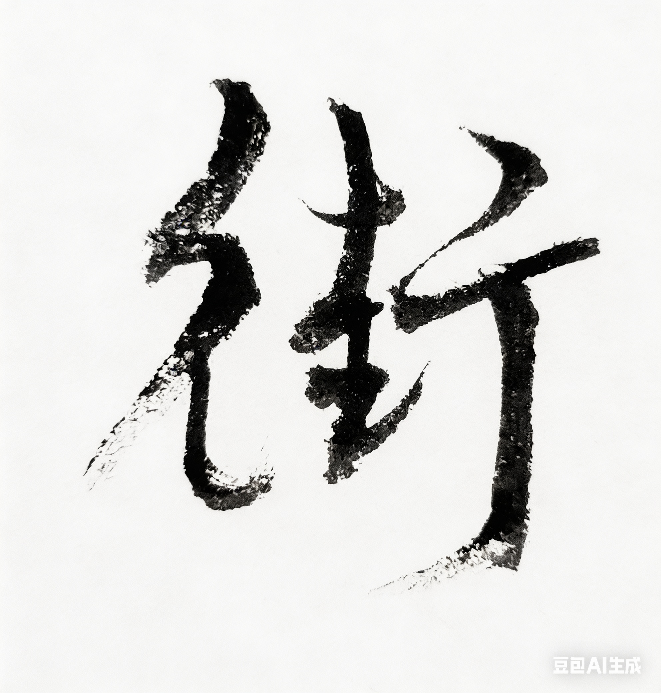

# Chapter 9: 街 {-}

*彭博、流浪、对冲*

> 街是另一种河，数字在流，人在走。
- 玄心

**tp_image**

{width=50% alpha=0.5}

## 彭博

离开网易以后，

我开始在金融市场里工作。

在瑞士信贷的时候，

我系统学习了金融基础。

我在美林接触了风险管理。

再后来去了纽约的彭博社,

做数量金融。

\
彭博既是新闻机构，

也是金融世界的一台机器。

屏幕上的每一条新闻，

每一个词，

每个数字，

都会在不同的终端上跳动。

有时候一条快讯，

能让市场震动半天。

交易员在世界各地，

盯这些东西伺机而动。

很多交易，

也是从这些新闻开始的。

\
白天我坐在办公室工作。

电视演播室就在旁边。

有时候主持人在前面播新闻，

我坐在后面，

做人肉背景。

镜头扫过来的时候，

我也在画面里。

像是这个金融世界的一块布景。

\
我之前很喜欢 Susan Li[^jie-susanli] 播的新闻。

可惜我加入的时候，

她已经走了。

幸好 Betty Liu[^jie-bettyliu] 还在那里，

我好几次在电梯里面遇到她，

每次我都会在朋友圈发消息，

说又遇到Betty Liu了。

给群友粉丝汇报下她今天的气色。

\
我见过很多美国名人来做访谈。

总统候选人Bernie Sanders[^jie-sanders] 来的时候，

进不去门，

不得不去前台照相拿通行证，

我在边上看着想，

这人怎么这么眼熟。

后来才反应过来，

这种大人物，

原来也要像我们一样在楼下打卡。

## 流浪

\
金融行业压力大，

我学会了抽一点假烟。

不然很难和同事交流。

烟不进肺，

只是叼在嘴里，

有一次我在楼下抽烟，

一个金发美女走过来，

问能不能抽一口我的烟。

我说这支刚抽一半，

不如给你一支新的。

前提是，

你得和我合一张影。

她笑了一下，

真的和我拍了张照片。

\
周末或者晚上不忙的时候，

我会带着吉他出去弹。

这是我大学时就憧憬过的事情。

在法拉盛，

我一般弹中国风，

比如《女儿情》。

在时代广场地铁口，

我会和讲西班牙语的音乐人一起Jam。

我们语言不通，

但音乐天然就是最好的语言。

地铁里音量要开到最大，

不然火车经过的时候，

音响几乎听不见。

\
那段时间我慢慢发现，

世界上有很多好心人。

有时候中午，

有人会给我送饭，

有时候也会往吉他箱里丢些钱。

我之后又拿这些钱，

去买别的流浪歌手的CD。

中美贸易战开打那段时间，

我去了白宫门前弹。

《成都》的指弹指法，

就是在那里慢慢摸出来的。

\
大学的时候，

很多男孩子都有一个流浪的梦。

我曾经很羡慕那些流浪歌手的自由。

后来我发现，

当真正走过很多地方以后，

人还是会回到自己的路上。

一个人到处流浪，

其实只是为了寻找回家的路。

## 对冲

我后来进了一家对冲基金。

那家公司在新加坡有一个分部，

名字叫世坤投资。

很多人不知道它，

但在量化交易的圈子里，

它很有名。

\
办公室不大，

但屏幕很多。

每个人桌上都有几块显示器，

上面是价格、曲线、订单。

市场开盘的时候，

数字不停地跳。

心跳也加快，

血压开始上升。

红的，绿的，

一秒一秒往前走。

有时候只是几秒钟，

盈亏就反转很多次。

\
我负责整个亚太区的交易，

从新西兰到印度。

所有从新加坡交易所下的单，

都是从我的名字发出去的。

当时系统所有的交易，

我是直接用root权限操作。

幸好从来没有出过差错。

现在想起来，

有点后怕。

\
那时候我们的系统跑得很快。

有时候屏幕上的盈亏

每秒钟会变动上千万美元。

开始的时候，

数字往上跳的时候，

人有一点兴奋；

往下跳的时候，

人会忽然很安静。

慢慢你就习惯了。

钱在屏幕上变成数字。

数字在屏幕上跳动。

有时候几百万，

只是一个毫秒的变化。

\
这个行业以冷酷著称，

只相信逻辑。

不能有一丝情绪波动。

天地不仁，

以万物为刍狗。

这是隔壁同事的座右铭。

该出手时就出手。

像古龙笔下的刀客，

只有一个字：

快。

\
老板叫伊戈尔[^jie-igor]。

说话不多，

但做事情很干脆。

他一般在美国。

来新加坡的时候，

他会带大家去吃饭。

出手极为大方。

有天中午，

我们去一家旋转餐厅。

那是新加坡很有名的一家餐厅。

在很高的楼上。

餐厅慢慢转，

整座城市在窗外一点点移动。

每个人的位置上，

都摆着鱼翅、燕窝，

还有很多我以前没吃过的东西。

\
技术部的主管叫马克。

晚上和大家一起喝酒。

服务员端来一瓶红酒，

说三千美金一瓶。

记不清我们开了几瓶。

我那时候还年轻，

对这些事情有一点不真实的感觉。

\
我白天在办公室看屏幕，

晚上在高楼里吃饭。

城市在窗外慢慢转。

但交易的时候，

世界又完全不同。

市场开盘以后，

所有人都盯着屏幕。

电话会响。

键盘会响。

不到一秒，

一个千万美金的单子就发出去了。

这些钱在不同的市场之间流动。

东京。

香港。

新加坡。

伦敦。

纽约。

地球转一圈，

交易也转一圈。

\
那几年,

我经常在夜里离开办公室。

新加坡的街很干净。

高楼很多。

港口在远处，

一排排船停在那里。

海风有一点咸味。

有时候我会忽然想起很远的事情。

想起山里的泉水。

想起溪边那块被人搬走的石头。

也想起广州办公室里的那幅字:

"云层之上无风雨"。

金融市场和那些东西很不一样。

这里是数字。

是价格。

是风险。

是对冲。

但路就是这样，

一段段往前走。

网易是网。

华尔街是街。

新加坡也是一条街。

你在不同的城市，

不同的楼里，

不同的时区，

做不同的事情。

但人还是同一个人。

街教会我的事情其实很简单：

世界很大。

大到可以容下很多种活法。

世界很大。

换一条街，

人生就会不一样。

[^jie-sanders]: 伯尼·桑德斯（Bernie Sanders，1941—），美国佛蒙特州联邦参议员，民主社会主义者，2016 年、2020 年两度参选总统、与希拉里·克林顿及拜登等角逐民主党提名；其间多次到彭博做访谈。

[^jie-susanli]: 苏珊·李（Susan Li），财经主播，曾在彭博电视亚太区主持早间节目《First Up》等，后任 CNBC、Fox Business 主播与记者。

[^jie-bettyliu]: 刘珍妮（Betty Liu，1973—），香港出生，曾任彭博电视纽约主播，主持《In the Loop》等节目；后创业并曾任纽交所副主席、洲际交易所首席体验官。

[^jie-igor]: 伊戈尔·图尔钦斯基（Igor Tulchinsky，1966—），量化资产管理公司WorldQuant（世坤投资）创始人兼首席执行官，2007年创立，曾任Millennium Management投资经理；白俄罗斯出生，德州大学奥斯汀分校计算机科学、沃顿商学院MBA。
